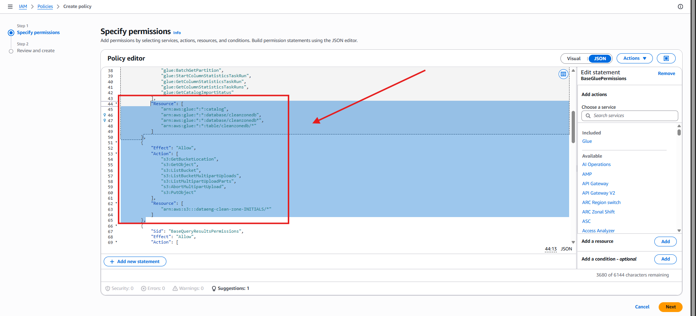
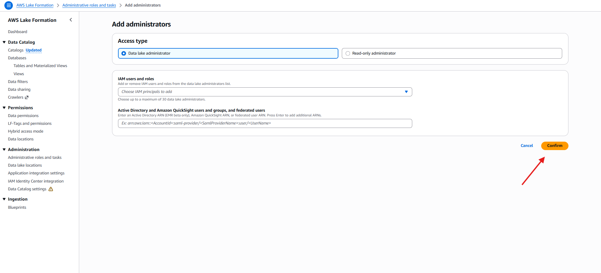
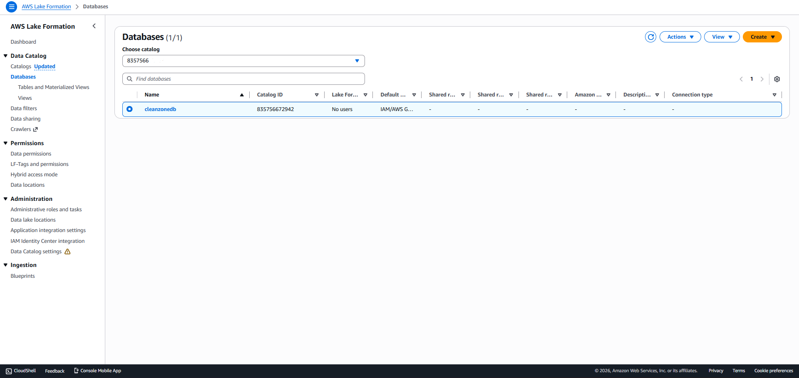
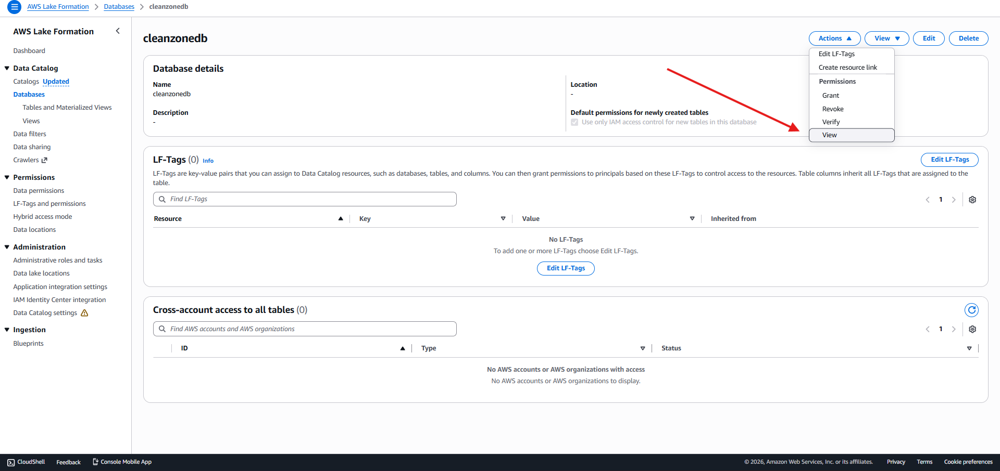
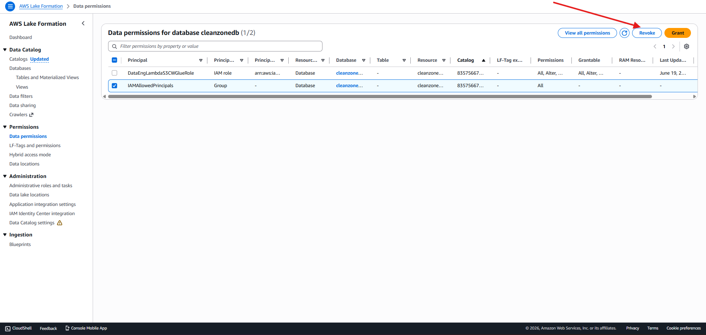
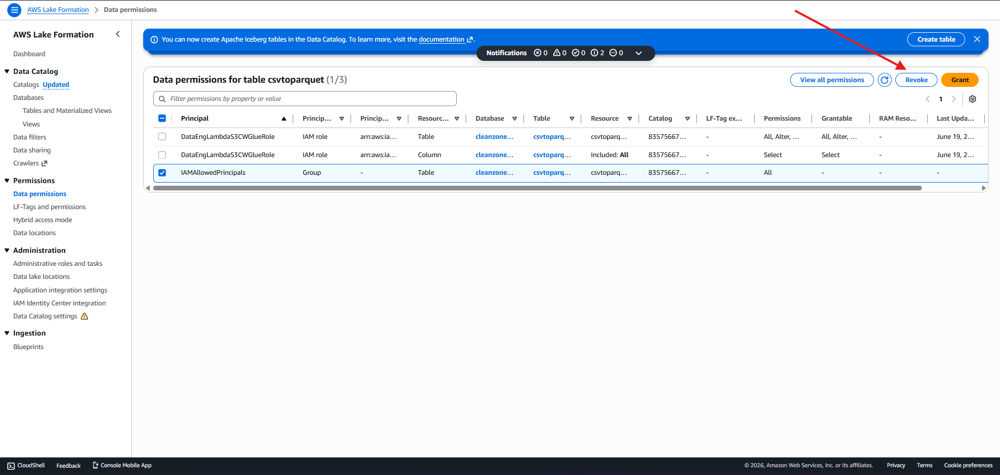
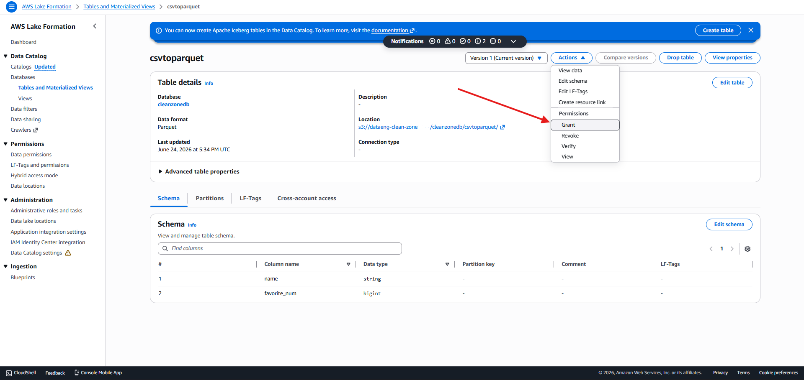
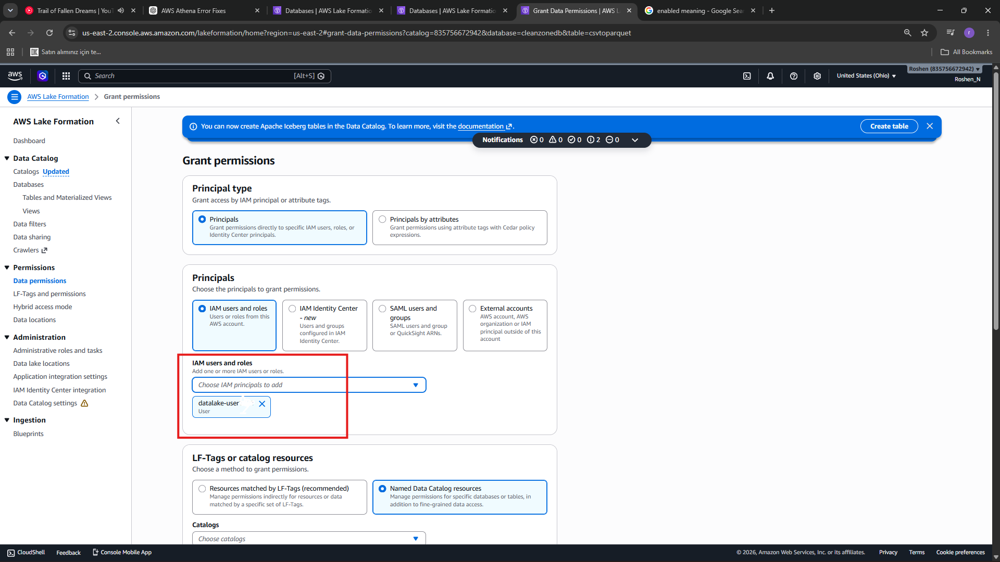
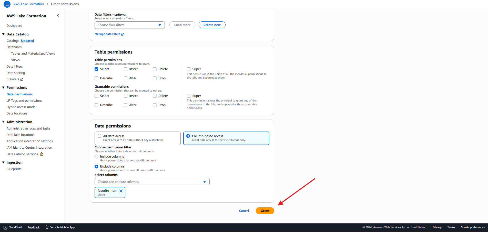
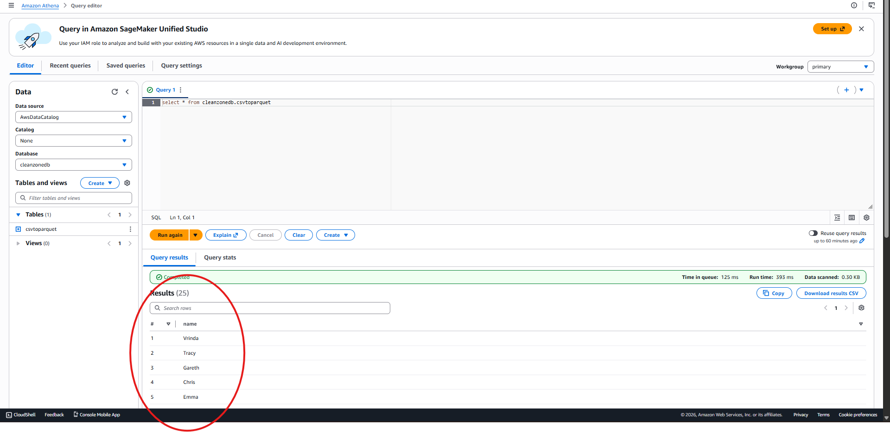

<h1 align="center">Configuring Lake Formation permissions</h1>

Before we implement Lake Formation permissions, we're going to create a new data lake user and configure their permissions using just IAM permissions.

<h2>Creating a new user with IAM permissions</h2>
<h3>On AWS Management Concole, go to the Policies on left-menu, filter in "Athena" and select AmazonAthenaFullAccess policy</h3>

  

<h3>Copy all JSON in that policy, and go back to create new policy and paste it on JSON Tab</h3>

  

<h3>In a new plocy JSON modify and insert new policies and resource from file policies.json</h3>

  

<h3>Once pasted click on Next:Review and enter policy name and click Create Policy</h3>

  

<h2>Now lets create new IAM user</h2>
<h3>In the IAM console, click on Users -> Enter user name</h3>

  

<h3>Next in Set Permissions: select "Attach ploicies directly" and in searchbox type the policy name we created recently and select -> Next</h3>

  

<h2>Now lets create new Amazon S3 bucket that can capture the results of any Athena queries</h2>
<h3>go to s3 service -> create bucket, type bucket name and leave other settings as default -> click-on Create Bucket</h3>

  

<h2>Now we can verify that our new user has access to CleanZoneDB and that the user can run Athena queries on table in this db</h2>
<h3>Sign-out aws console and sign-in to new user account we created, and search for Athena service</h3>

  

<h3>Before we can run an Athena Query, we need to set up a query result location in Amazon S3.</h3>

  

<h3>Edit Settings -> Manage, then select s3 bucket name we created recently, click on Save</h3>

  

<h3>On Editor tab, run the SQL query in picture below, if all permissions have been configured correctly, the result of the query should be displayed</h3>

  

-------------------------------------------------------------------------------------------------------------------------------------------------------

<h2>Managing permissions with AWS Lake Formation.</h2>

With our initial setup, we granted Glue Data Catalog permissions to datalake-user in an IAM policy. Let's have a look at how-permissions are set up on the cleanzonedb database and tables in Lake Formation

<h3>Go to Lake Formation service, first time when you access a pop-up box will show up -> Add Myself -> Get Started. On next page select Data Lake Administrator as Access type -> Confirm</h3>

  

<h3>Then on the left bar: select Databases -> cleanzonedb</h3>

  

<h3>Then click-on Actions on top right -> View permissions</h3>

  

<h3>On the View Permissions screen: there's IAMAllowedPrincipals, select this and press Revoke button on top-right</h3>

  

<h3>We wanna do same thing for csvtoparquet table: Databases -> cleanzonedb -> View Tables -> csvtoparquet -> click on Actions/View Permissions -> select IAMAllowedPrincipals -> Revoke</h3>

  

<h2>Let's add specific Lake Formation permissions for our datalake-user to access the cleanzone database and csvtoparquet table</h2>
<h3>LakeFormation console -> Databases -> click-on cleanzonedb -> View Tables -> csvtoparquet table -> then click Actions/Grant</h3>

  

<h3>In the Grant Permssions page: from IAM users and roles dropdown, select datalake-user</h3>

  

<h3>For Table Permissions, select Column-Based access -> Exclude columns -> select column "favorite_num" column -> click-on Grant</h3>

  

<h3>Now if we log in to datalake-user and run the "Select * from cleanzonedb.csvtoparquet" query on Athena it will return only name column, bc we excluded column "favorite_num"</h3>

  

