<h1 align="center">With AWS DMS replicating a database into an Amazon S3 based data lake.</h1>
<h2>1.Deploying MySQL and an EC2 data loader via CloudFormation</h2>
<h3>To get started download the CloudFormation template from mysql-ec2loader.cfn and save it.</h3>
<h3>In AWS Management Consoles search bar, search for CloudFormation -> Create stack</h3>

  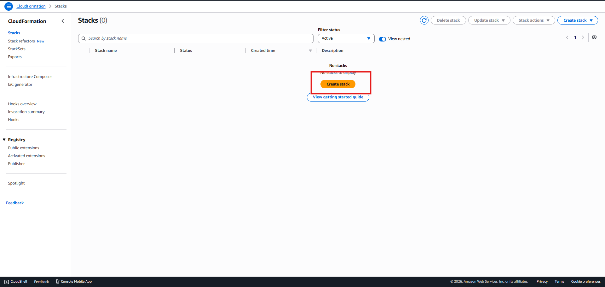

<h3>Specify template section -> Upload template file -> Select file mysql-ec2loader.cfn you downloaded -> Next</h3>

  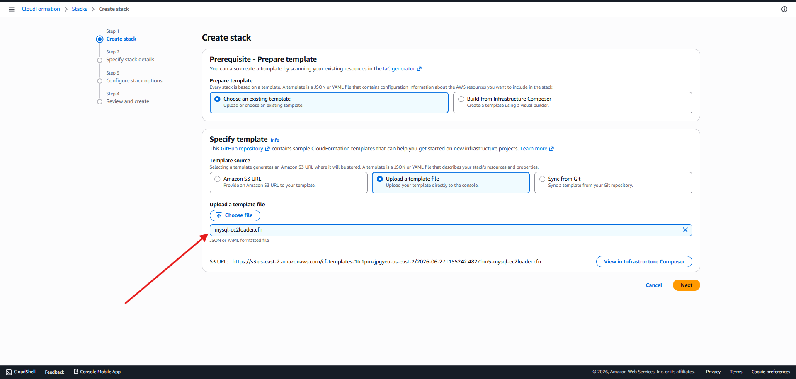

<h3>For Stack name, provide a name you like</h3>

  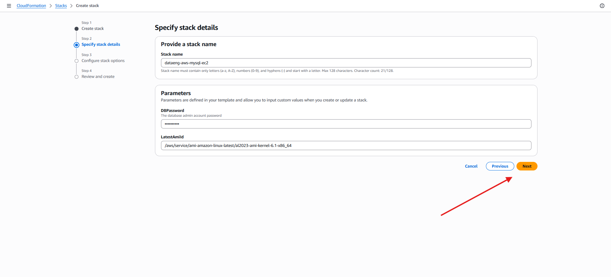

<h3>leave the rest of the parameters as default and Submit</h3>

  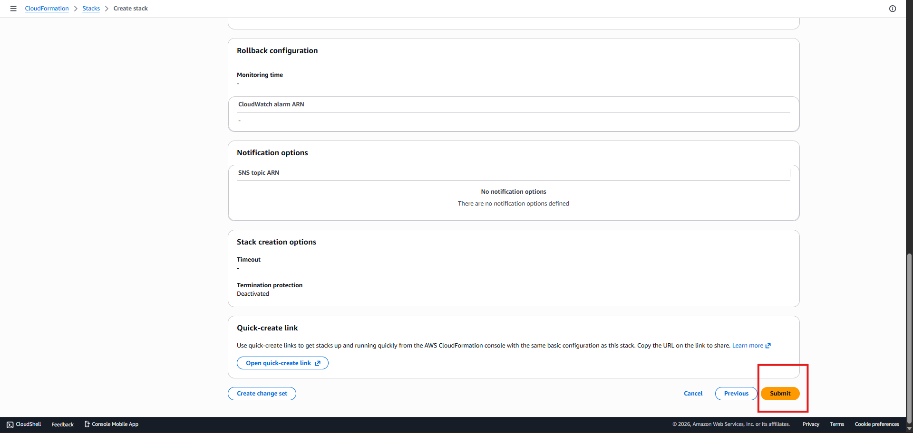

<h3>once the deployment finished, the stack status will change to CREATE_COMPLETE</h3>

  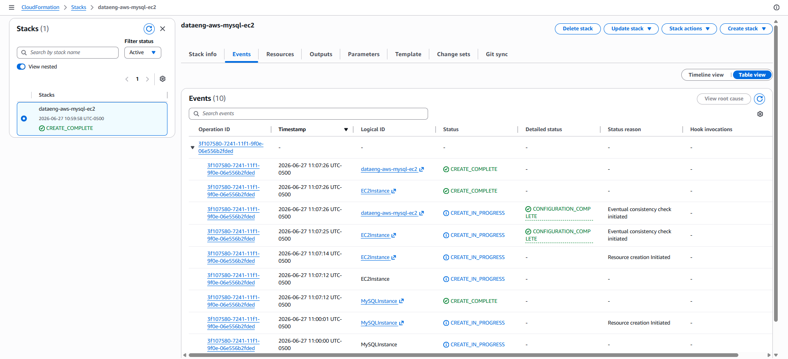

<h2>2.We will create an IAM policy and role that will allow DMS to write to our target S3 bucket</h2>
<h3>IAM service -> Policies -> Create policy -> replace the boilerplate code in the box with the code in picture -> Next</h3>

  

<h3>Provide policy name</h3>

  

<h3>Trusted Entity Type: AWS Service -> Use case: DMS -> Next</h3>

  

<h3>Add permissions -> select policy name we just created -> Next</h3>

  

<h3>provide a descriptive Role name -> Create Role</h3>

  

<h2>3.Configuring DMS settings and performing a full load from MySQL to S3</h2>

We will create DMS replication instance(a managed EC2 instance that connects to the source endpoint, retrieves data, and writes to the target endpoint)

<h3>DMS service -> Migrate or Replicate -> Replication instances -> Create replication instance -> provide name -> instance class: dms:t3:micro -> Allocated storage: 10 -> High Availability: Dev or test workload</h3>

  

<h3>Vpc dropdown -> default VPC -> Create replication instance</h3>

  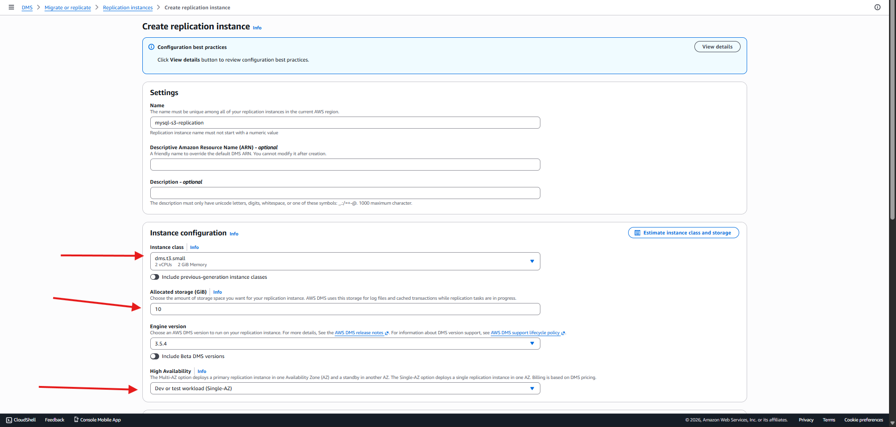

<h3>DMS -> Migrate or Replicate -> Endpoints -> Create endpoint -> Source endpoint -> Select RDS DB instance -> select MySQL DATABASE that was created by the CloudFormation template/h3>

  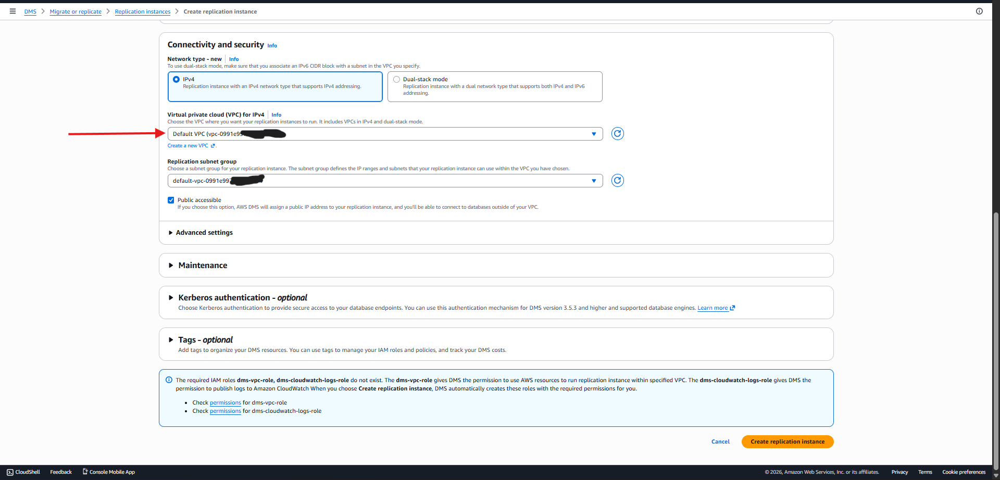

<h3>select Provide access information manually -> enter the password for MySQL db -> SSL mode: select NONE -> Create Endpoint button</h3>

  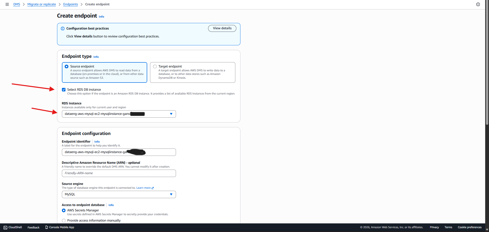

<h3>DMS -> Migrate or Replicate -> Endpoints -> Create endpoint -> select Target endpoint -> provide name for endpoint -> Target engine: Amazon S3</h3>

  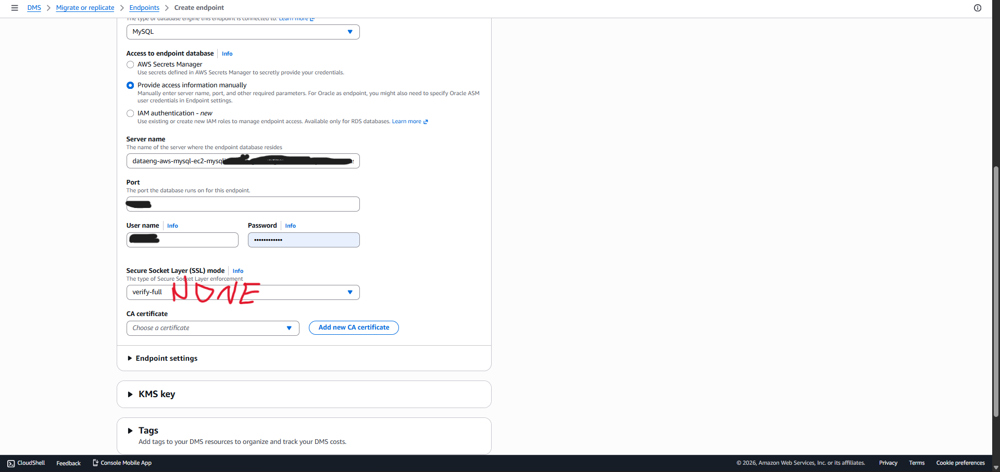

<h3>Amazon S3 bucket: landing-zone bucket name -> IAM role: the role we created for s3 bucket -> Create endpoint</h3>

  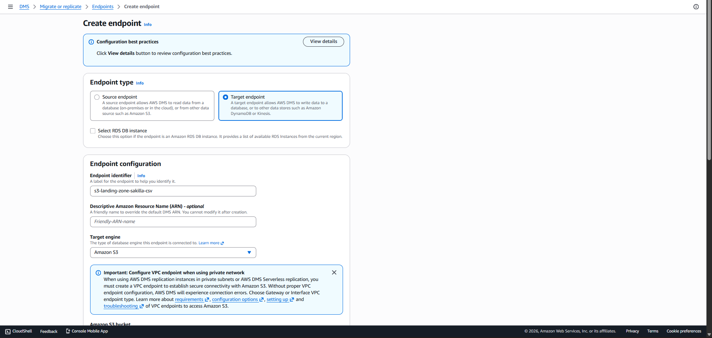

<h3>DMS -> Tasks -> Create Task -> provide name for Task identifier -> select the endpoints accordingly we created for Source and Target endpoints</h3>

  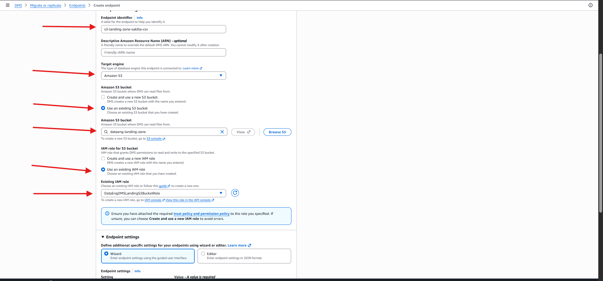

<h3>Schema name: %sakila% -> Schema table name: % -> Selection rules: default -> Create Task</h3>

  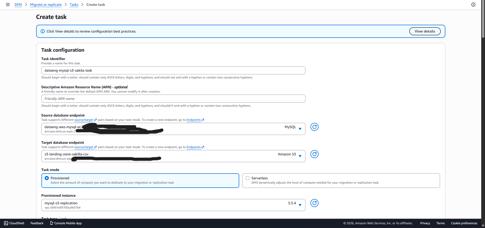

