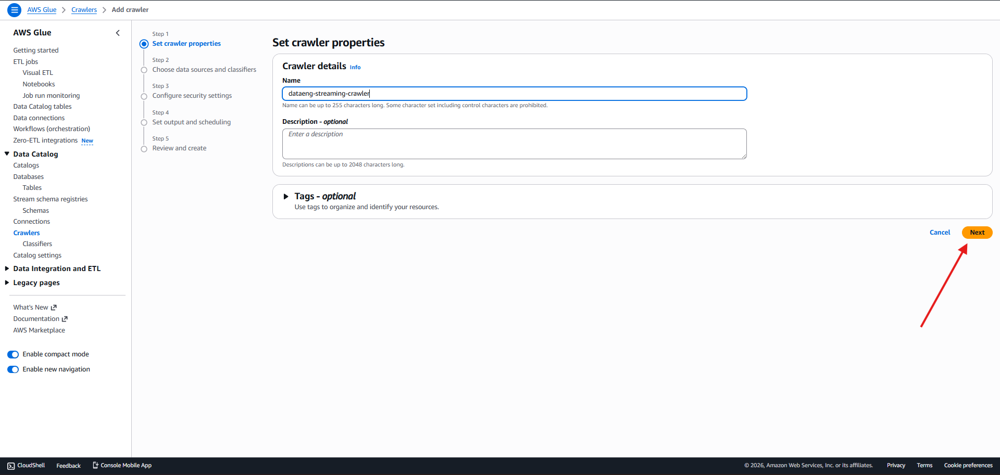
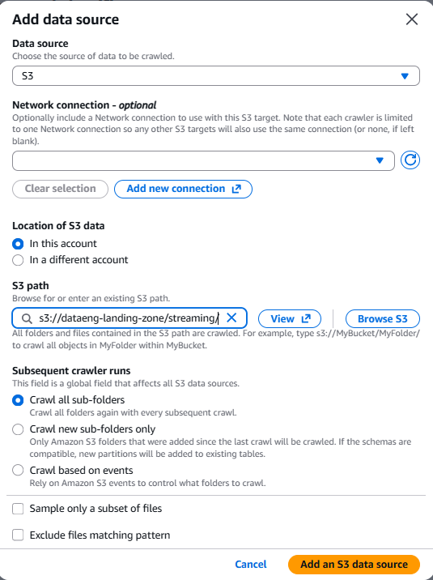
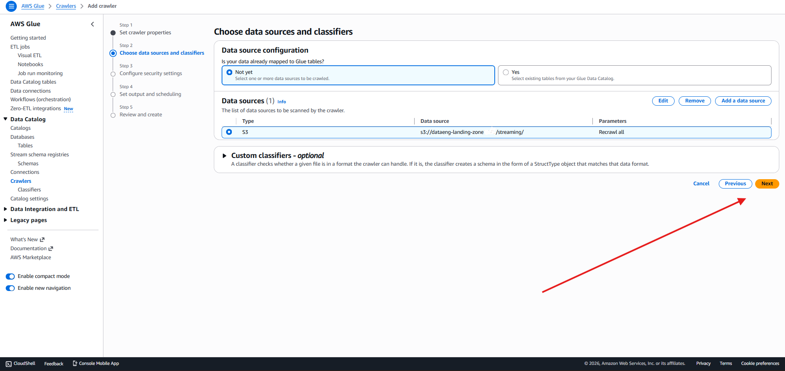
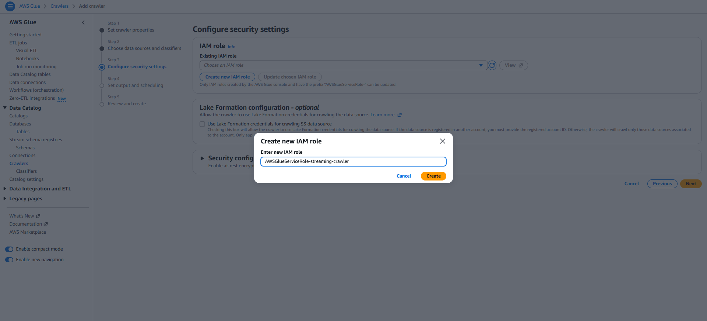
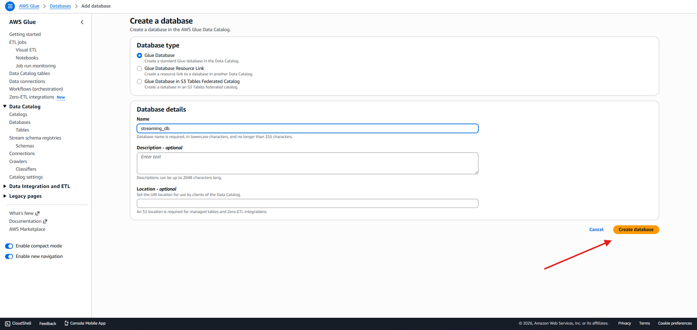
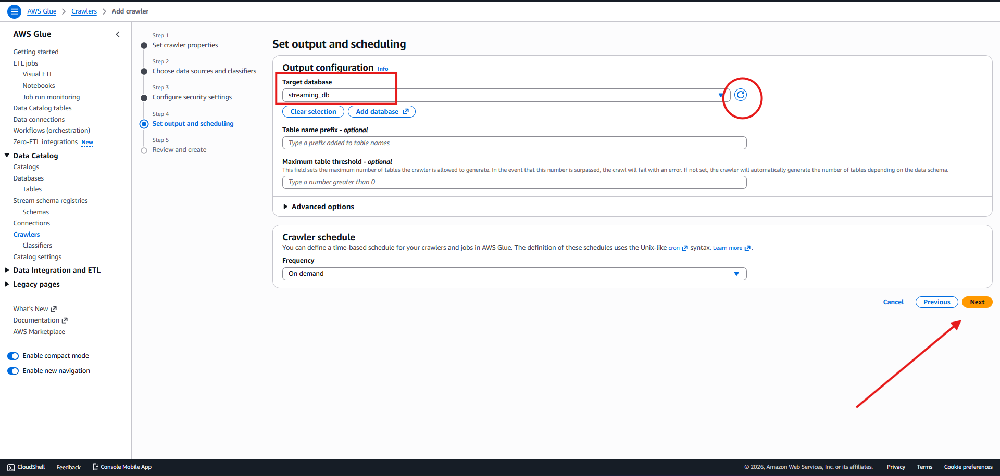
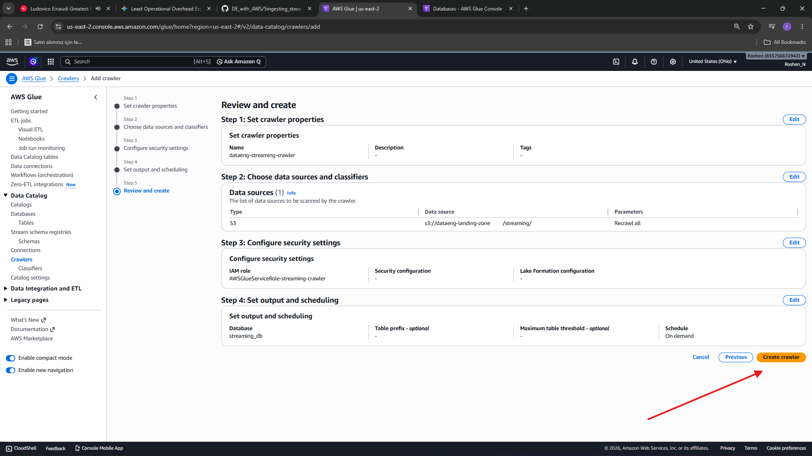
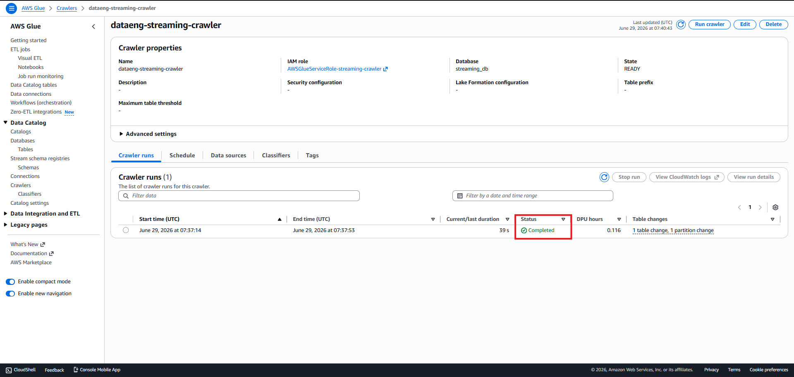

<h1 align="center">Streaming sample data to Amazon Kinesis with Amazon Kinesis Data Generator (KDG)</h1>
<h2>Configuring Kinesis Data Firehose for streaming delivery to Amazon S3</h2>
<h3>Kinesis service -> Amazon Data Firehose -> Create Firehose Stream</h3>

  

<h3>Source: Direct Put -> Destination: Amazon s3 -> provide Firehose stream name</h3>

  

<h3>Destination settings: select s3 bucket landing zone we created before -> provide prefix as pic for s3 bucket prefix and for s3 bucket error output prefix</h3>

  

<h3>Buffer size: 1MB -> Buffer interval -> 60sec -> leave other settings as default -> Create delivery stream</h3>

  

<h2>Configuring Amazon Kinesis Data Generator (KDG)</h2>
<h3>Open the KDG help page in browser https://awslabs.github.io/amazon-kinesis-data-generator/web/help.html -> Create Cognito User with CloudFormation</h3>

  

<h3>Create stack page -> leave as default -> Next</h3>

  

<h3>Specify stack details: provide username and password -> Next</h3>

  

<h3>Configure stack options -> leave as default -> Next</h3>

  

<h3>Submit the stack</h3>

  

<h3>once stack has been successfully deployed -> Outputs tab -> click KinesisDataGeneratorUrl value -> enter username & password -> set Region as yours aws account -> copy template code from github file: template</h3>

  

<h3>for strea/delivery stream -> select the Kinesis Data Firehose stream we created -> Records per second: 10 -> click send data -> wait KDG to send data for at least 3000-6000 records</h3>

  

<h2>Adding newly ingested data to the Glue Data Catalog</h2>
<h3>Glue service -> Crawlers -> Create crawler -> provide name -> Next</h3>

  

<h3>Data source -> add data source -> S3 path: dataeng-landing-zone/streams/ -> add an s3 data source</h3>

  

<h3>Leave other settings as default on Data source configuration page -> Next</h3>

  

<h3>IAM role -> create new IAM role -> provide name -> Create</h3>

  

<h3>Set output and scheduling page -> Add database -> Glue database -> provide name: streaming_db -> Create database</h3>

  

<h3>Output configuration -> select streaming_db -> Next</h3>

  

<h3>Review and Create: create crawler</h3>

  

<h3>select new crawler from list -> run crawler -> wait until completed</h3>

  

