<h1>Joining datasets with AWS Glue Studio</h1>
<h2>Creating a new data lake zone</h2>
<h3>AWS Console -> Glue -> Databases -> Add Database -> provide DB name -> Create database</h3>

  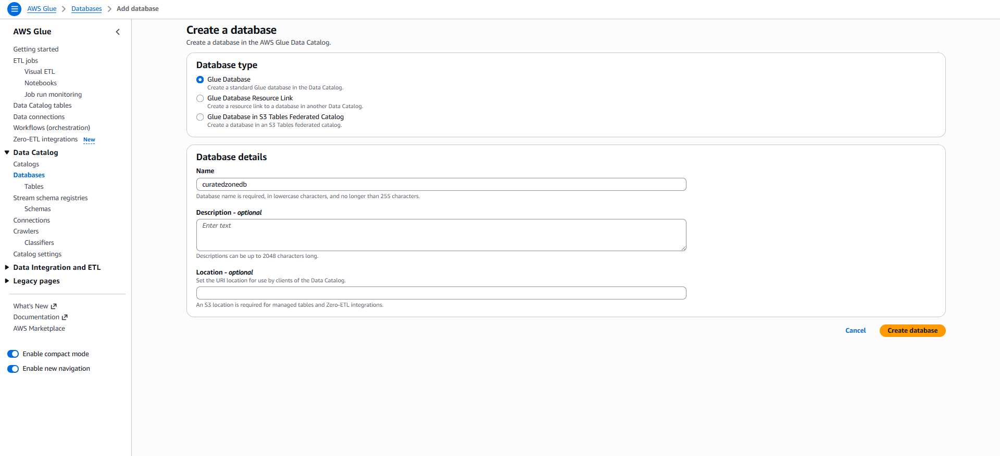

<h2>Creating new IAM role for the Glue job</h2>
<h3>AWS Console -> IAM -> Policies -> Create policy -> copy the JSON policy code from policies file -> paste -> Next</h3>

  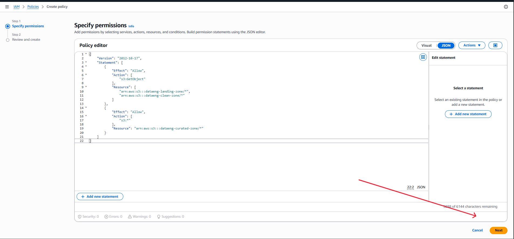

<h3>provide policy name -> Create policy</h3>

  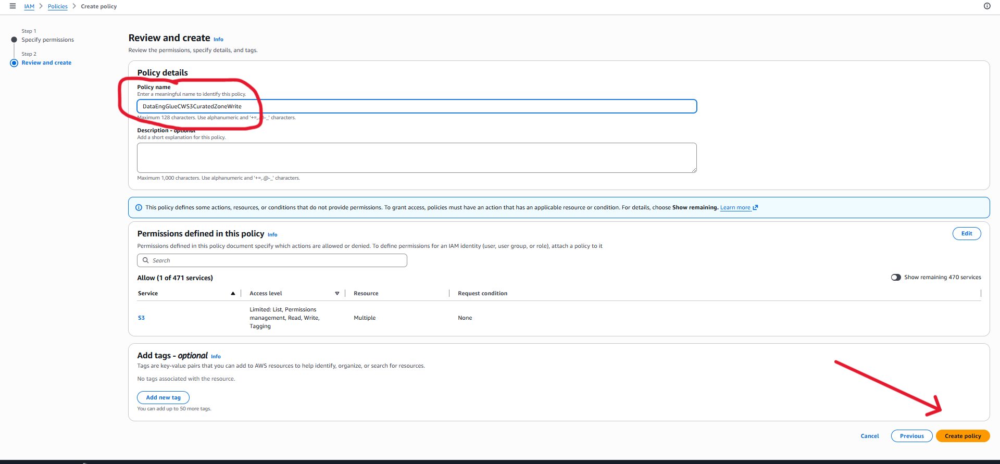

<h3>Roles -> Create role -> Trusted entity: AWS service -> Use case: Glue -> Next</h3>

  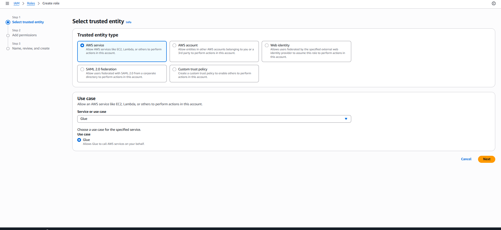

<h3>Attach permissions -> select the policy we just created on search bar -> also select policy named: AWSGlueServiceRole -> Next</h3>

  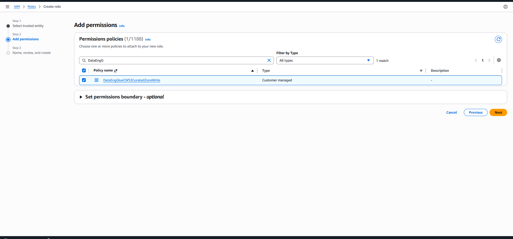

<h3>provide Role name -> Create role</h3>

  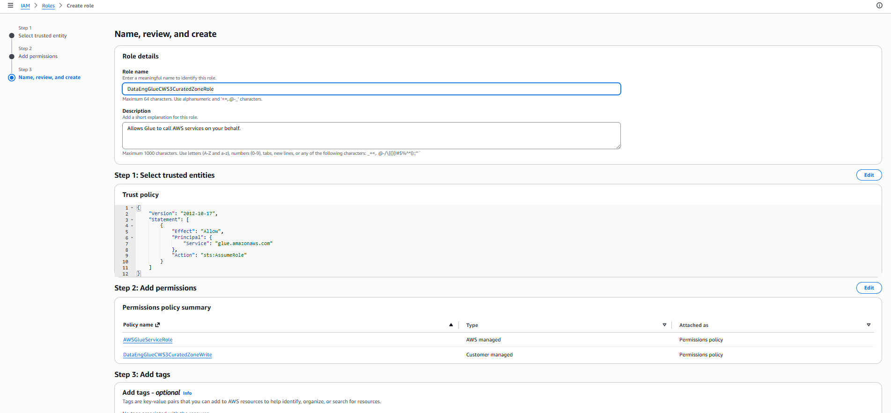

<h2>Configuring a denormalization transform using AWS Glue Studio</h2>
<h3>Glue -> ETL Jobs -> Amazon S3 (source) as a new node</h3>

  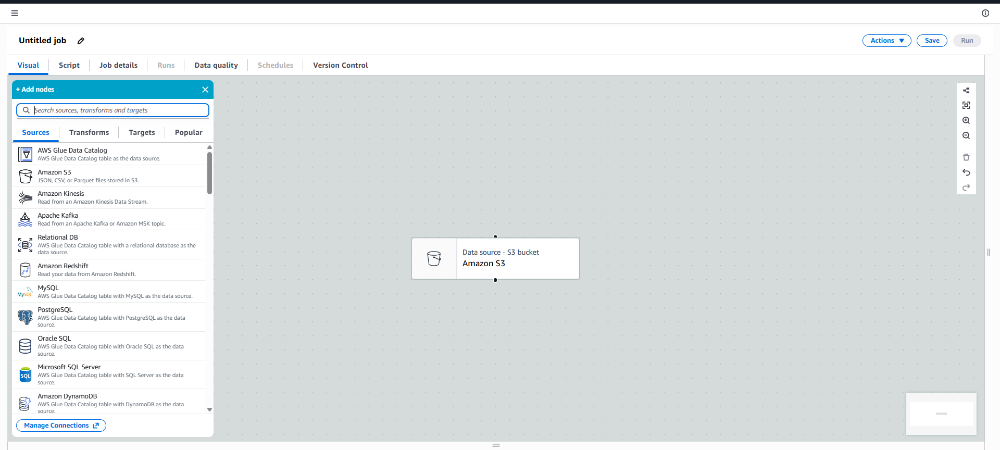

<h3>click on new source -> Data source properties Tab -> select Data Catalog table -> Database: sakila -> Table: film_category -> and set name for this node s3-film-category</h3>

  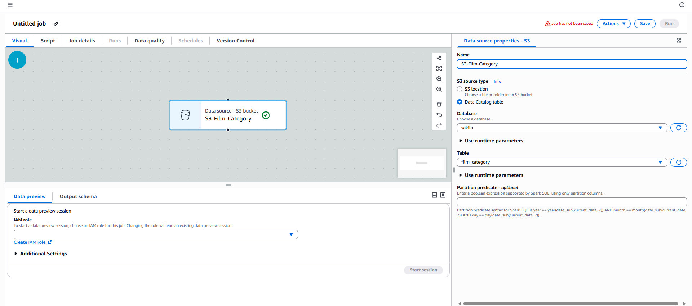

<h3>Add new node (plus sign) -> Amazon s3 (source) -> Data source properties-s3 -> select Data Catalog table -> database: sakila -> table: film -> name: s3-film</h3>

  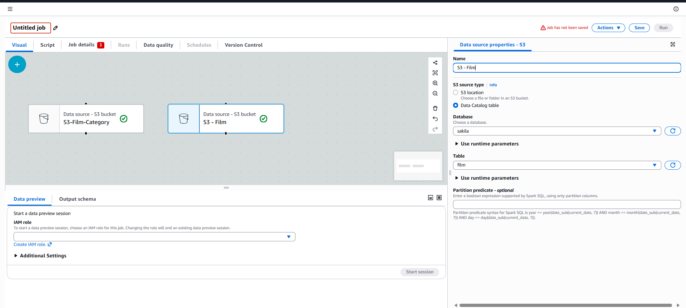

<h3>Designer Tab -> plus sign -> Transform -> Join</h3>

  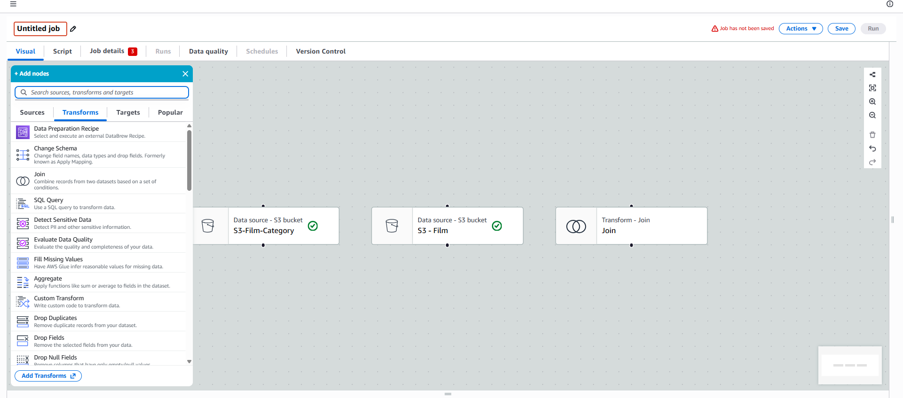

<h3>Node parents dropdown -> select s3-film and s3-film-category -> click on Resolve it button to rename column name -> Join type: left join -> Add condition -> s3-film: film_id -> renamed keys for join: right_film_id -> name: join-film-category-id</h3>

  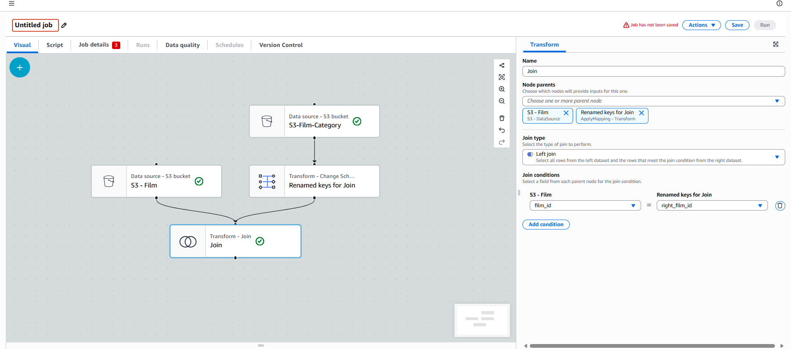

<h3>Plus sign -> Transforms -> Change schema -> Drop checkboxes for unwanted columns</h3>

  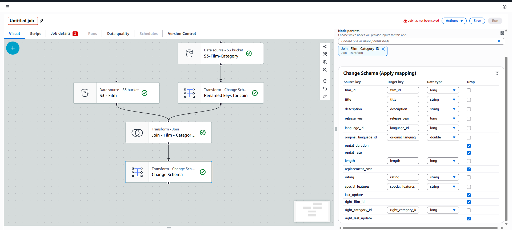

<h3>Plus sign -> Sources: Amazon S3 -> select Data Catalog Table -> Database: sakila -> Table: Category -> name: s3-category</h3>

  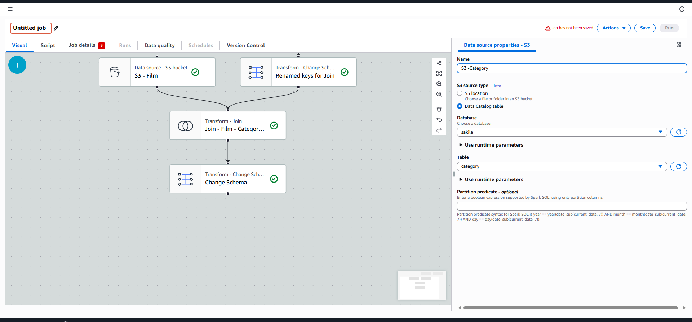

<h3>Plus sign -> Transforms -> Join -> Node parents: Change schema and s3-category -> name: join-film-category -> Join Type: Left -> Add condition: s3-category:category_id and change schema: right_category_id</h3>

  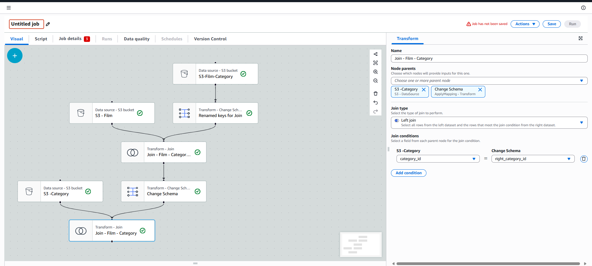

<h3>PLus sign -> Transforms -> Change schema -> drop unwanted columns -> Source key: name change to category_name</h3>

  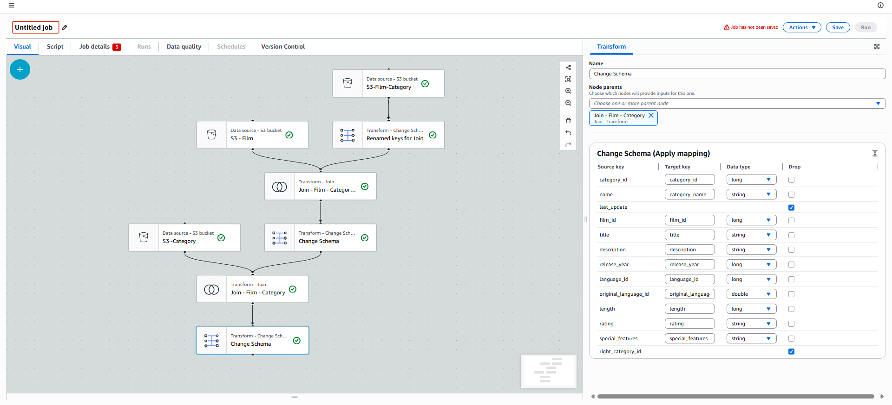

<h2>Finalizing the denormalization transform job to write to s3</h2>
<h3>Plus sign -> Targets -> Amazon s3 -> Format: Parquet -> Compression type: Snappy -> Target Location: dataeng-curated-zone/filmdb/film_category -> Database: curatedzonedb -> Table name: film_category</h3>

  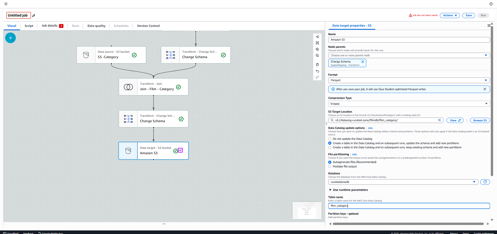

<h3>Job Details Tab -> set name for job -> IAM role: select DataEngGlueCWS3CuratedZoneRole -> Number of workers: 2 -> Job Bookmark: Disable -> Nr. of retries: 0 -> Save -> Run</h3>

  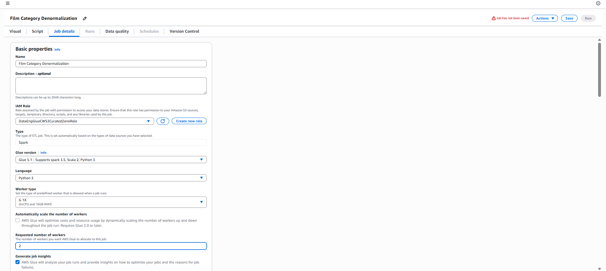

