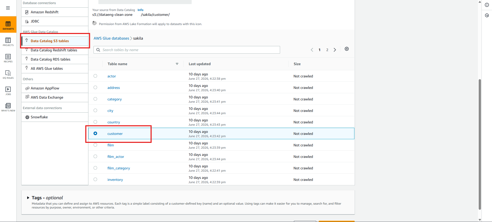
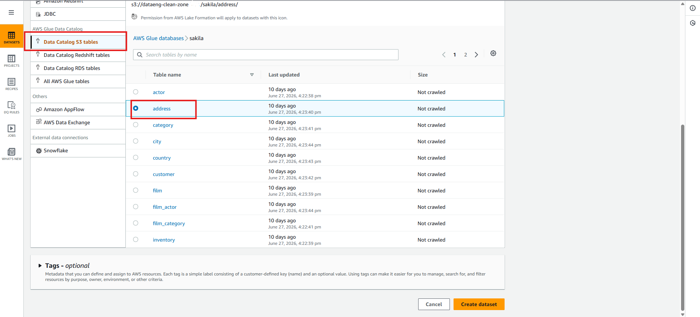
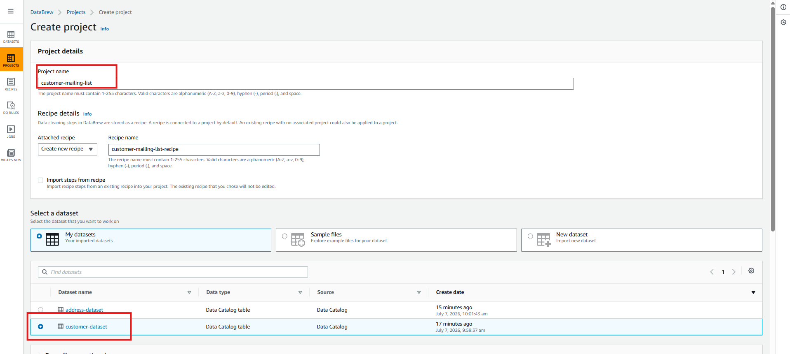
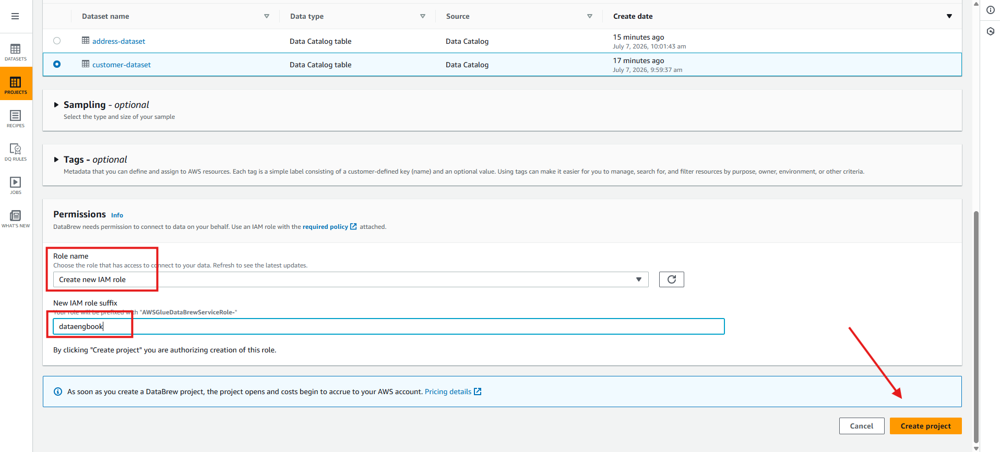
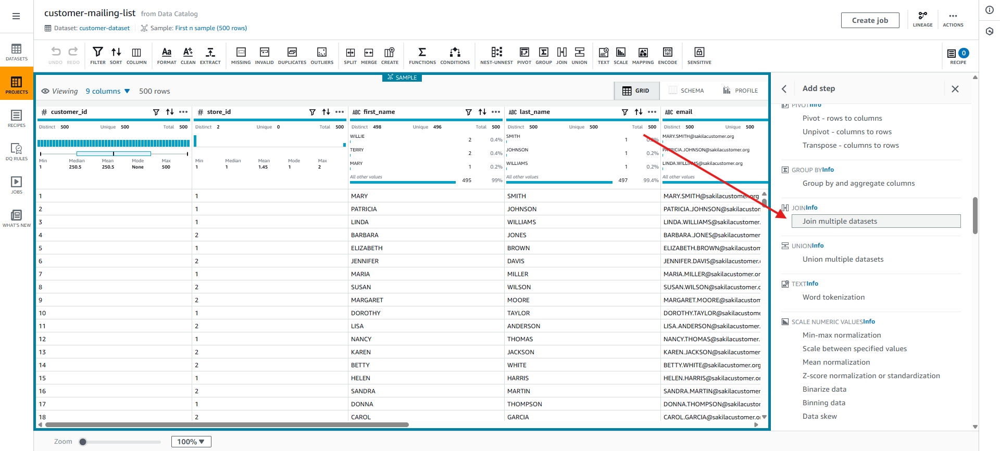
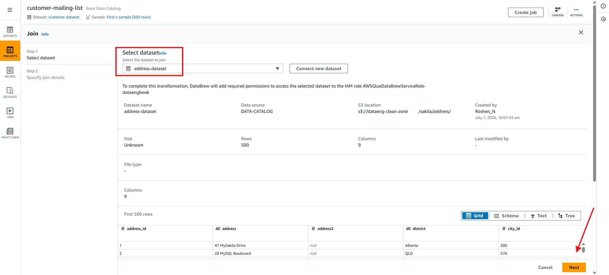
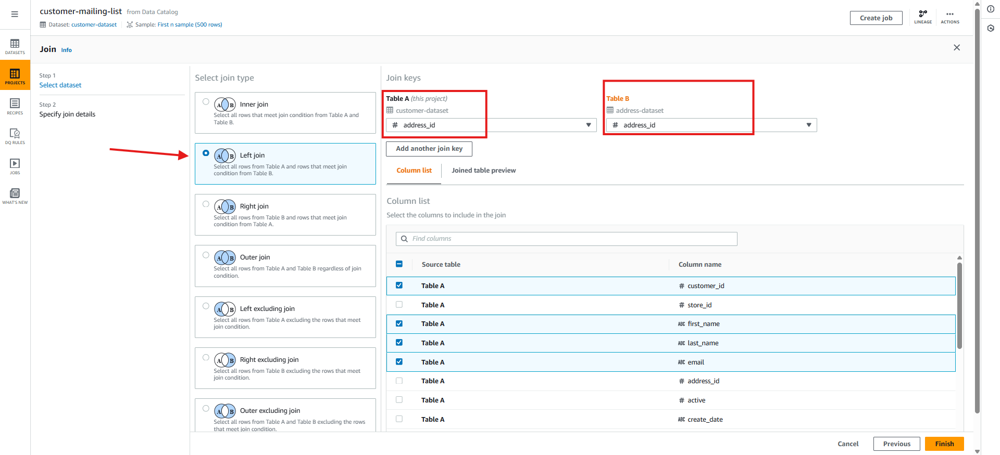
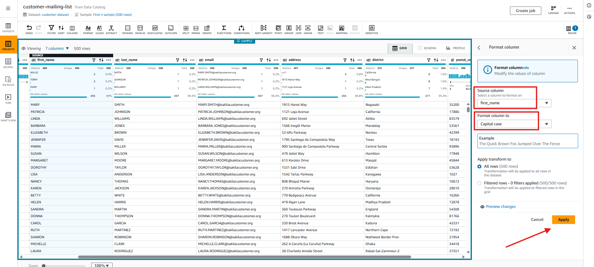
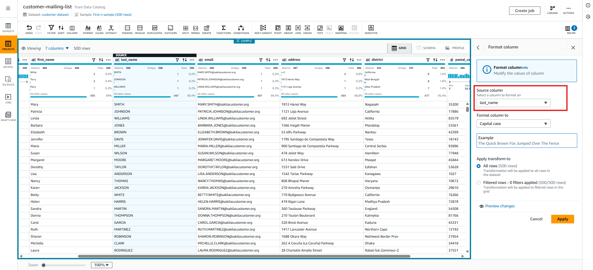
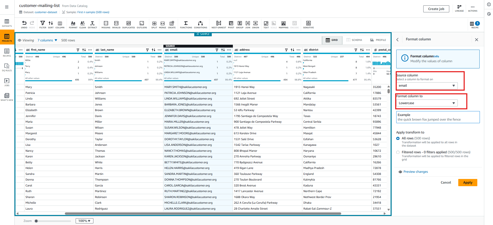

<h1 align="center">Creating data transformations with AWS Glue DataBrew</h1>

In this section, we will have a role as data analyst who has been tasked with creating a mailing list that can be used to send marketing material to the customers of our video store, to make them aware that our catalo of movies is now available for streaming.

<h2>Configuring new datasets for AWS Glue DataBrew</h2>
<h3>Glue DataBrew -> Datasets -> Connect new dataset -> Dataset name: customer-dataset -> click on Data Catalog S3 tables -> click on sakila -> customer table -> Create dataset</h3>

  

<h3>Connect new dataset -> Dataset name: address-dataset -> click on Data Catalog S3 tables -> click on sakila -> address table -> Create dataset</h3>

  

<h2>Creating a new Glue DataBrew project</h2>
<h3>AWS Glue DataBrew -> Projects -> Create project -> project name: customer-mailing-list -> Recipe details: Create new recipe -> Select a dataset: customer-dataset</h3>

  

<h3>Permissions -> Create new IAM role -> IAM role suffix: dataengbook -> Create project</h3>

  

<h2>Let's build Glue DataBrew recipe</h2>
<h3>Add step in the recipe panel -> select Join multiple datasets</h3>

  

<h3>Select dataset: address-dataset -> Next</h3>

  

<h3>Join type: Left -> Join keys: address_id both -> Column list: select only necessary columns for marketing team -> Finish</h3>

  

<h3>Recipe panel: add step -> Format/Change to capital case -> Source column: first_name -> Format column: capital case -> Apply</h3>

  

<h3>Recipe panel: add step -> Format/Change to capital case -> Source column: last_name -> Format column: capital case -> Apply</h3>

  

<h3>Recipe panel: add step -> Format/Change to lowercase case -> Source column: email -> Format column: lowercase -> Apply</h3>

  

