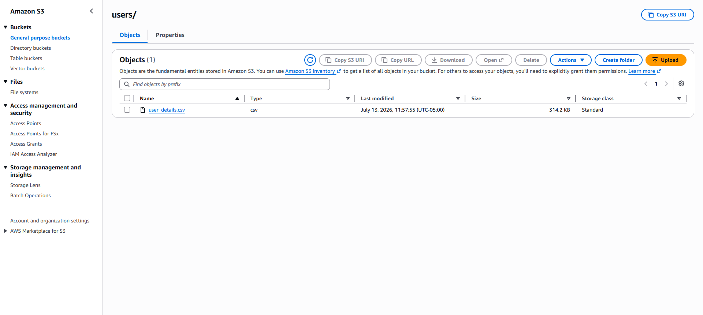
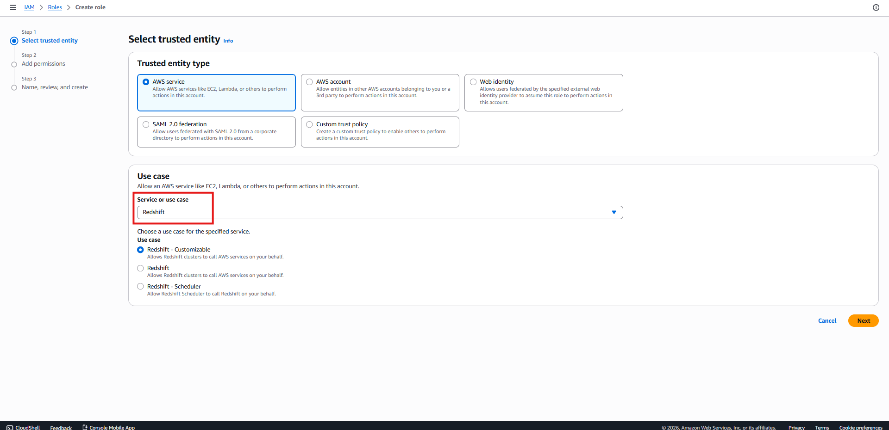
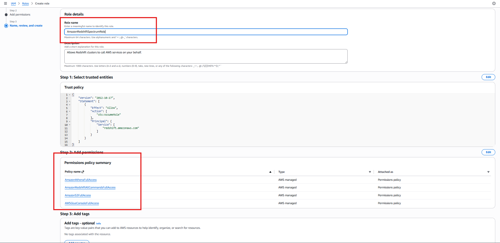
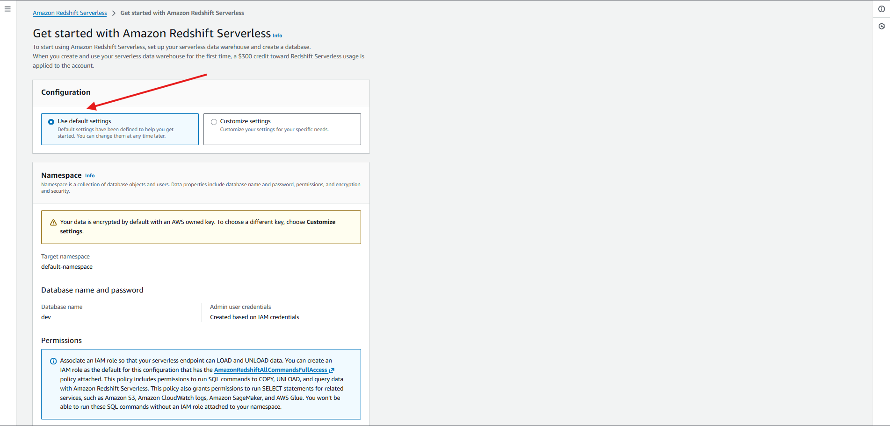
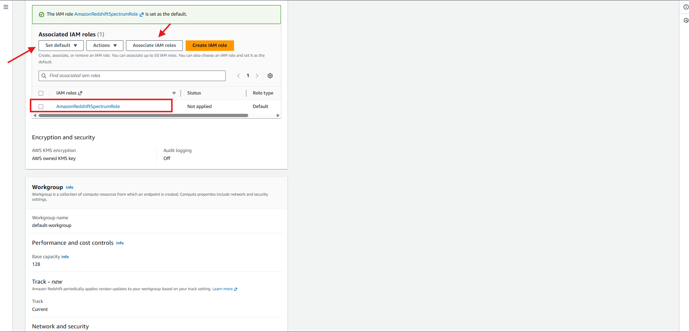
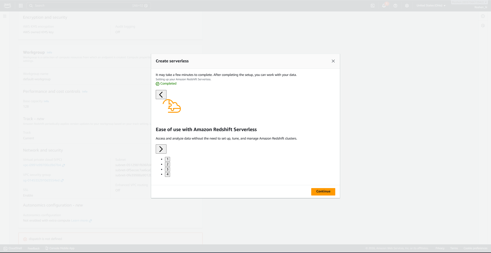
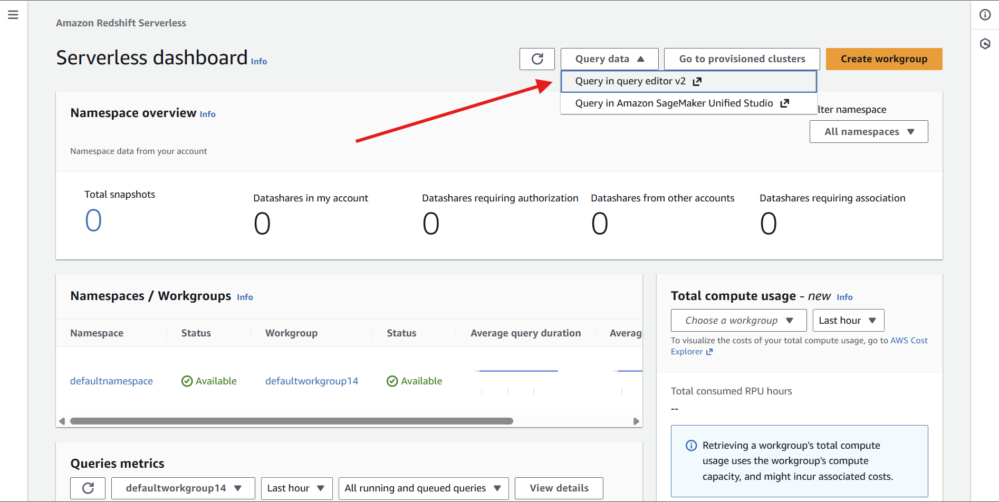
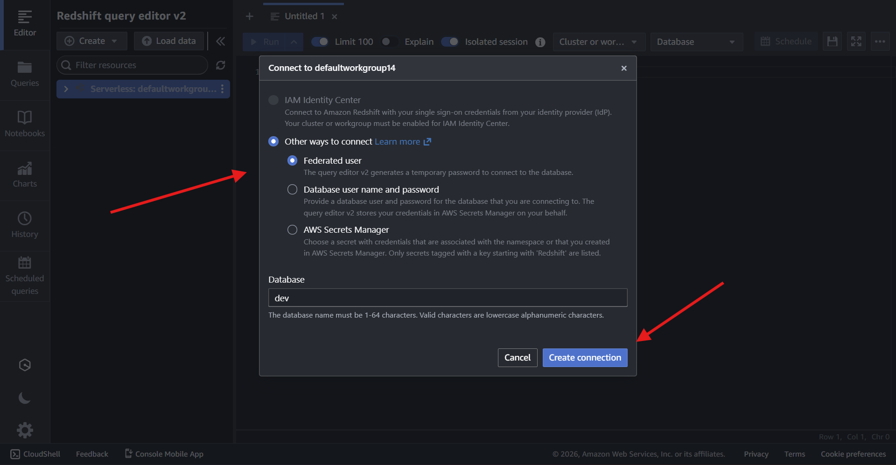

<h1 align="center">Deploying Redshift Serverless cluster and running Redshift Spectrum queries.</h1>

In this section we're going to create a new Redshift Serverless cluster and configure Redshift Spectrum so that we can query data in external tables on Amazon S3.

<h2>Uploading sample data to Amazon S3</h2>
<h3>Download the generic data named "user_details.csv" from dataset folder -> Amazon S3 service -> dataeng-landing-zone -> create folder "users" -> upload csv file in it</h3>

  

<h2>Let's create Role for Redshift</h2>
<h3>AWS IAM -> Roles -> Create role -> select AWS service -> Use case: Redshift -> Redshift - customizable -> Next</h3>

  

<h3>Attach 4 folliwing policies -> provide Role name: AmazonRedshiftSpectrumRole</h3>

  

<h2>Creating a Redshift cluster</h2>
<h3>Amazon Redshift -> Try Redshift Serverless free trial -> Configuration: Use default settings</h3>

  

<h3>Associated IAM roles -> select AmazonRedshiftSpectrumRole -> click Associate IAM role -> select the role associated -> Set default -> Make default -> Confirm</h3>

  

<h3>Save configuration -> this will create Amazon Redshift Cluster</h3>

  

<h2>Now let's query data in the data lake with Redshift Spectrum</h2>
<h3>Amazon Redshift Serverless dashboard -> Query data -> Query editor v2</h3>

  

<h3>Connect to defoult workgroup we created -> federated user -> Create connection</h3>

  

